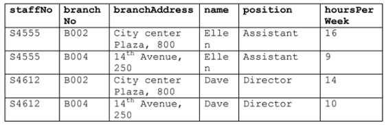
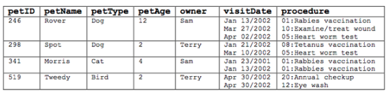

# Example 1

Consider the following relation to answer the questions that follows. 

a) The relation is NOT in 1NF. Why? 
 
b) Normalize the relation to 1NF. 

# Example 2

Consider the following relation to answer the questions that follows. 

a) The relation is NOT in 2NF. Why? 

    Key is {staffNo, branchNo}
    functional dependencies:
    staffNo -> name, position //partial dependency
    branchNo -> branchAddress   //partial dependency
    {staffNo, branchNo} -> hoursPerWeek
 
b) Normalize the relation to 2NF, showing the (partial) functional dependencies to the key. 

Staff [staffNo *, name, position]
Branches [branchNo *, branchAddress]
Branch-Staff [staffNo*, branchNo*, hoursPerWeek]

# Example 3

Consider the following relation to answer the questions that follows. 

a) Normalize the relation to 1NF. 

make new rows for each of the extra rows where petid = 246,
petid = 296, pet id= 341, petid = 519
break procedure up into procId and procDes

b) Normalize the relation to 2NF. 

Key is {petId, visitDate, procId}
functional dependecies:
petId -> petName, petType, petAge, owner
procId -> procDes
{petId, visitDate, procId} ->

Pets (petId*, petName, petType, petAge, owner)
Procedures (procId*, procDes)
Pets-Procedures(petId*, visitDate*, procId*)

# Example 4

Consider the following invoice.

From the invoice, we can derive the following unnormalized (UNF) relation: 	

Normalize the invoice relation to 3NF.  Assume, based on the previous exercise, that each pet can be uniquely identified by an ID and that each procedure also has an unique ID. Also, consider adding an ID to uniquely identify a customer, pet and procedure. 

 

